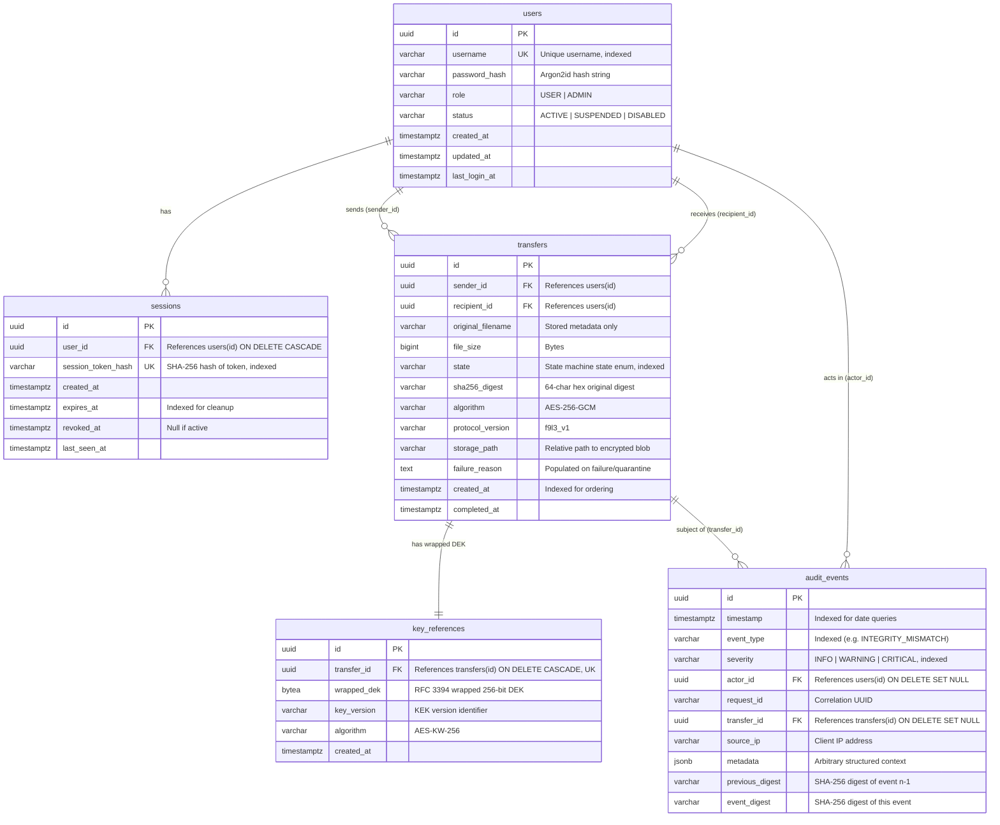

# Database Architecture & Relational Schema — f9l3_53nd

**Document Version**: 1.0.0  
**Project**: `f9l3_53nd` — Secure Authenticated File Transfer Platform  
**Database Engine**: PostgreSQL 16 (ACID Compliant)  
**Migration Framework**: Alembic (Async SQLAlchemy Core)  

---

## 1. Entity-Relationship Diagram (ERD)



---

## 2. Table Specifications & DDL Definitions

### 2.1 Table: `users`
Stores user identities, roles, and Argon2id password hashes.
```sql
CREATE TABLE users (
    id UUID PRIMARY KEY DEFAULT gen_random_uuid(),
    username VARCHAR(50) UNIQUE NOT NULL,
    password_hash VARCHAR(255) NOT NULL,
    role VARCHAR(20) NOT NULL DEFAULT 'USER' CHECK (role IN ('USER', 'ADMIN')),
    status VARCHAR(20) NOT NULL DEFAULT 'ACTIVE' CHECK (status IN ('ACTIVE', 'SUSPENDED', 'DISABLED')),
    created_at TIMESTAMPTZ NOT NULL DEFAULT NOW(),
    updated_at TIMESTAMPTZ NOT NULL DEFAULT NOW(),
    last_login_at TIMESTAMPTZ
);

CREATE INDEX idx_users_username ON users(username);
CREATE INDEX idx_users_status ON users(status);
```

---

### 2.2 Table: `sessions`
Tracks active user session cookies and supports instant server-side revocation.
```sql
CREATE TABLE sessions (
    id UUID PRIMARY KEY DEFAULT gen_random_uuid(),
    user_id UUID NOT NULL REFERENCES users(id) ON DELETE CASCADE,
    session_token_hash VARCHAR(64) UNIQUE NOT NULL,
    created_at TIMESTAMPTZ NOT NULL DEFAULT NOW(),
    expires_at TIMESTAMPTZ NOT NULL,
    revoked_at TIMESTAMPTZ,
    last_seen_at TIMESTAMPTZ NOT NULL DEFAULT NOW()
);

CREATE INDEX idx_sessions_token_hash ON sessions(session_token_hash);
CREATE INDEX idx_sessions_user_id ON sessions(user_id);
CREATE INDEX idx_sessions_expires_at ON sessions(expires_at);
```

---

### 2.3 Table: `transfers`
Maintains the authoritative state, metadata, and digest verification tracking of all file transfers.
```sql
CREATE TABLE transfers (
    id UUID PRIMARY KEY DEFAULT gen_random_uuid(),
    sender_id UUID NOT NULL REFERENCES users(id),
    recipient_id UUID NOT NULL REFERENCES users(id),
    original_filename VARCHAR(255) NOT NULL,
    file_size BIGINT NOT NULL CHECK (file_size >= 0),
    state VARCHAR(30) NOT NULL DEFAULT 'CREATED' CHECK (
        state IN (
            'CREATED', 'VALIDATING', 'HASHING', 'ENCRYPTING',
            'READY', 'TRANSFERRING', 'RECEIVED', 'AUTHENTICATING',
            'DECRYPTING', 'VERIFYING', 'COMPLETED', 'FAILED',
            'QUARANTINED', 'REJECTED', 'REPLAY_DETECTED'
        )
    ),
    sha256_digest VARCHAR(64) NOT NULL,
    algorithm VARCHAR(30) NOT NULL DEFAULT 'AES-256-GCM',
    protocol_version VARCHAR(20) NOT NULL DEFAULT 'f9l3_v1',
    storage_path VARCHAR(500),
    failure_reason TEXT,
    created_at TIMESTAMPTZ NOT NULL DEFAULT NOW(),
    completed_at TIMESTAMPTZ
);

CREATE INDEX idx_transfers_sender_id ON transfers(sender_id);
CREATE INDEX idx_transfers_recipient_id ON transfers(recipient_id);
CREATE INDEX idx_transfers_state ON transfers(state);
CREATE INDEX idx_transfers_created_at ON transfers(created_at DESC);
```

---

### 2.4 Table: `key_references`
Stores wrapped Data Encryption Keys (DEKs) securely linked to their corresponding transfer.
```sql
CREATE TABLE key_references (
    id UUID PRIMARY KEY DEFAULT gen_random_uuid(),
    transfer_id UUID UNIQUE NOT NULL REFERENCES transfers(id) ON DELETE CASCADE,
    wrapped_dek BYTEA NOT NULL,
    key_version VARCHAR(50) NOT NULL DEFAULT 'v1',
    algorithm VARCHAR(30) NOT NULL DEFAULT 'AES-KW-256',
    created_at TIMESTAMPTZ NOT NULL DEFAULT NOW()
);

CREATE INDEX idx_key_references_transfer_id ON key_references(transfer_id);
```

---

### 2.5 Table: `audit_events`
Chained, tamper-evident audit log recording all security-sensitive operations.
```sql
CREATE TABLE audit_events (
    id UUID PRIMARY KEY DEFAULT gen_random_uuid(),
    timestamp TIMESTAMPTZ NOT NULL DEFAULT NOW(),
    event_type VARCHAR(50) NOT NULL,
    severity VARCHAR(20) NOT NULL DEFAULT 'INFO' CHECK (severity IN ('INFO', 'WARNING', 'CRITICAL')),
    actor_id UUID REFERENCES users(id) ON DELETE SET NULL,
    request_id VARCHAR(64),
    transfer_id UUID REFERENCES transfers(id) ON DELETE SET NULL,
    source_ip VARCHAR(45),
    metadata JSONB NOT NULL DEFAULT '{}'::jsonb,
    previous_digest VARCHAR(64) NOT NULL,
    event_digest VARCHAR(64) NOT NULL
);

CREATE INDEX idx_audit_events_timestamp ON audit_events(timestamp DESC);
CREATE INDEX idx_audit_events_event_type ON audit_events(event_type);
CREATE INDEX idx_audit_events_severity ON audit_events(severity);
CREATE INDEX idx_audit_events_actor_id ON audit_events(actor_id);
CREATE INDEX idx_audit_events_transfer_id ON audit_events(transfer_id);
CREATE INDEX idx_audit_events_metadata ON audit_events USING GIN(metadata);
```

---

## 3. Data Integrity & Query Access Patterns

| Query Pattern / Operation | Query Filter / Joins | Applied Index | Expected SLA |
| :--- | :--- | :--- | :--- |
| **Authenticate Session** | `WHERE session_token_hash = :hash AND expires_at > NOW() AND revoked_at IS NULL` | `idx_sessions_token_hash` | < 2ms |
| **User Transfers List** | `WHERE sender_id = :uid OR recipient_id = :uid ORDER BY created_at DESC` | Composite `(sender_id, created_at)` | < 5ms |
| **Transfer Ownership Check** | `WHERE id = :tid` | Primary Key (`id`) | < 1ms |
| **Admin Audit Query** | `WHERE event_type = :type AND timestamp >= :t1 ORDER BY timestamp DESC` | Composite `(event_type, timestamp)` | < 10ms |

---

## 4. Alembic Migration Strategy

1. All schema modifications are authored as deterministic Alembic migration scripts in `backend/migrations/versions/`.
2. Migrations run automatically during startup or via `make setup`.
3. Direct manual `ALTER TABLE` statements against PostgreSQL production tables are strictly forbidden.
