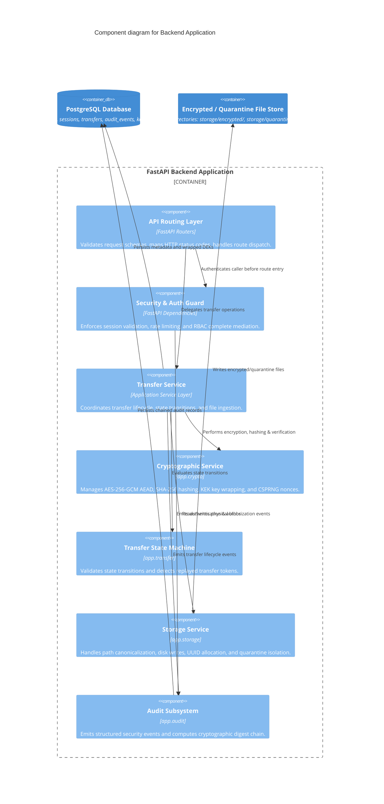

# C4 Model — Backend Component Diagram (Level 3)

**Project**: `f9l3_53nd` — Secure Authenticated File Transfer Platform  

---

## 1. Backend Component Diagram

The Component diagram decomposes the Backend Application container into internal modular services, dependency injection layers, and cryptographic boundaries.

---

## 2. Component Coupling & Invariants

1. **No Crypto in API Handlers**: Cryptographic operations are isolated strictly within `app.crypto.*`. Route handlers are thin controllers performing only request parsing, dependency injection, and response serializing.
2. **No Direct Filesystem Calls in Services**: All disk interactions pass through `app.storage.file_store.FileStore`, enforcing path traversal checks and UUID directory scoping.
3. **Mandatory Audit Side-Effects**: State transitions and security-sensitive events must invoke `AuditService.record_event()` inside the same database transaction.
