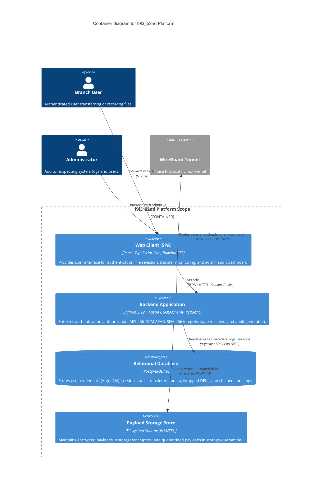

# C4 Model — Container Diagram (Level 2)

**Project**: `f9l3_53nd` — Secure Authenticated File Transfer Platform  

---

## 1. Container Diagram

The Container diagram zooms into the `f9l3_53nd` system, showing high-level software blocks, execution environments, and communication protocols.

---

## 2. Container Characteristics & Isolation

| Container | Technology | Responsibilities | Security Controls |
| :--- | :--- | :--- | :--- |
| **Web Client** | React 18 / TypeScript | Presentation, file selection, state display | No crypto keys stored; strict HTML sanitization |
| **Backend App** | FastAPI / Python 3.12+ | Orchestration, AEAD, SHA-256, State Machine | Non-root container (appuser), Least privilege |
| **Database** | PostgreSQL 16 | ACID metadata persistence, JSONB audit indexing | Parameterized queries, UUID primary keys |
| **Blob Storage**| Filesystem Volume | Encrypted payload and quarantine containment | UUID path abstraction outside web root |
| **WireGuard** | Noise Protocol / UDP | Branch network tunnel encapsulation | Curve25519 public key peer authentication |
