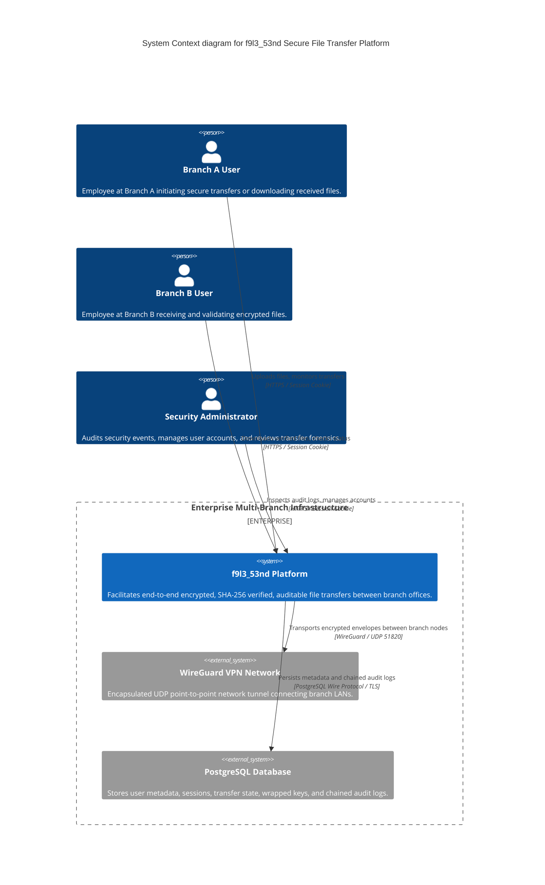

# C4 Model — System Context Diagram (Level 1)

**Project**: `f9l3_53nd` — Secure Authenticated File Transfer Platform  

---

## 1. System Context Diagram

The System Context diagram illustrates how `f9l3_53nd` fits into the broader enterprise environment, interacting with users and external boundary systems.

---

## 2. Context Interactions & Responsibilities

| Interacting Entity | Interaction Channel | Security Controls Enforced |
| :--- | :--- | :--- |
| **Branch Users (A & B)** | Web Browser (HTTPS) | Session Authentication (Argon2id + HttpOnly cookie), RBAC, Object Ownership |
| **Security Administrator** | Admin Web Console (HTTPS) | RBAC (`ADMIN` role check), Strict audit log access |
| **WireGuard Transport** | UDP Port 51820 | ChaCha20-Poly1305 network encapsulation, Curve25519 peer verification |
| **PostgreSQL Database** | Port 5432 (TLS) | Parameterized queries, No plaintext keys stored, Encrypted password hashes |
