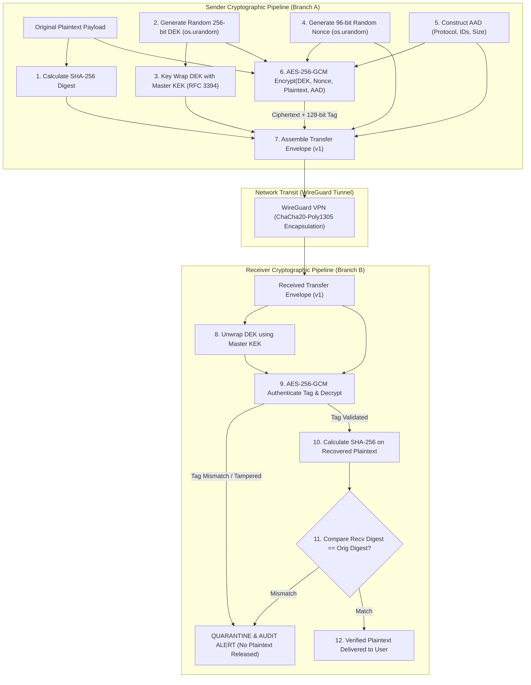

# Architecture Diagram — Cryptographic Pipeline Flow

**Project**: `f9l3_53nd` — Secure Authenticated File Transfer Platform  

---

## 1. Cryptographic Pipeline Flowchart

---

## 2. Cryptographic Formulae & Invariants

1. **Original Digest Calculation**:
   $$\text{Digest}_{\text{orig}} = \text{SHA-256}(\text{Plaintext})$$
2. **Key Encryption Key (KEK) Wrapping**:
   $$\text{WrappedDEK} = \text{AES-KeyWrap}_{\text{KEK}}(\text{DEK}_{\text{ephemeral}})$$
3. **AEAD Encryption & Tag Generation**:
   $$(\text{Ciphertext}, \text{Tag}_{128}) = \text{AES-256-GCM-Encrypt}(\text{Key}=\text{DEK}, \text{IV}=\text{Nonce}_{96}, \text{PT}=\text{Plaintext}, \text{AAD})$$
4. **Post-Decryption Verification Guard**:
   $$\text{Assert}(\text{AES-256-GCM-Decrypt}(\text{DEK}, \text{Nonce}, \text{Ciphertext}, \text{AAD}, \text{Tag}) == \text{Plaintext})$$
   $$\text{Assert}(\text{SHA-256}(\text{Plaintext}) == \text{Digest}_{\text{orig}})$$
