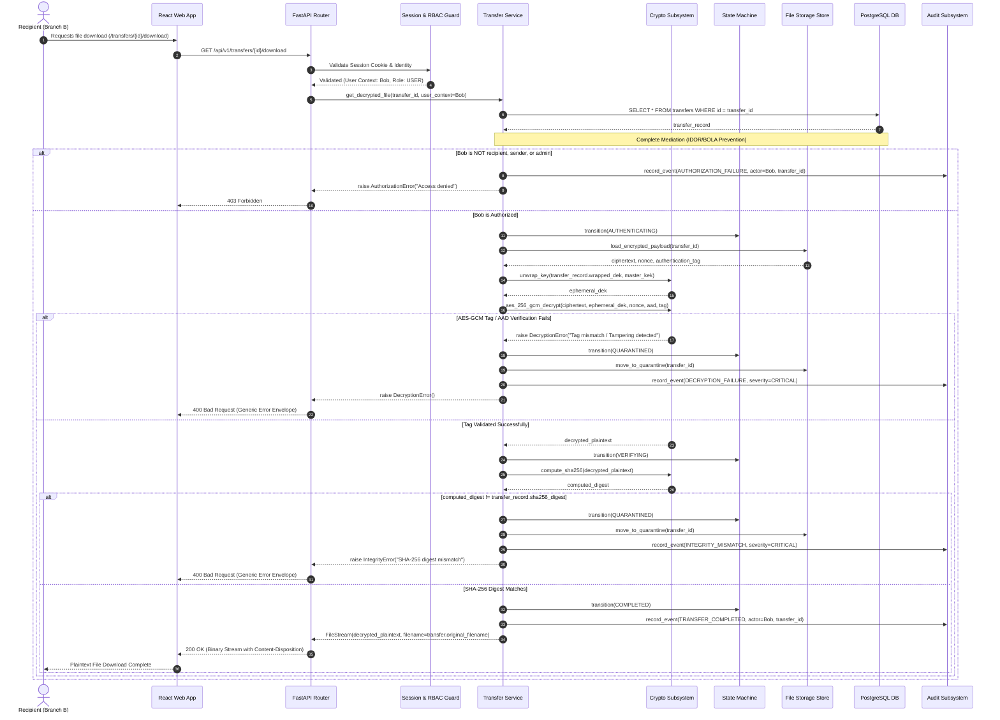

# Architecture Diagram — Reception & Download Sequence

**Project**: `f9l3_53nd` — Secure Authenticated File Transfer Platform  

---

## 1. Reception, Decryption & Download Sequence

---

## 2. Invariant Checklist during Download

1. **Complete Mediation (BOLA/IDOR)**: The server verifies that `current_user.id == transfer.recipient_id` (or sender/admin) before initiating any decryption or storage reads.
2. **Zero Plaintext Output on Tag Failure**: If the AES-GCM authentication tag check fails, processing terminates immediately, no partial plaintext is released, and payload is isolated to quarantine.
3. **Double Verification Lock**: Plaintext is delivered to the client *only after* the computed post-decryption SHA-256 digest exactly matches the pre-recorded sender digest.
