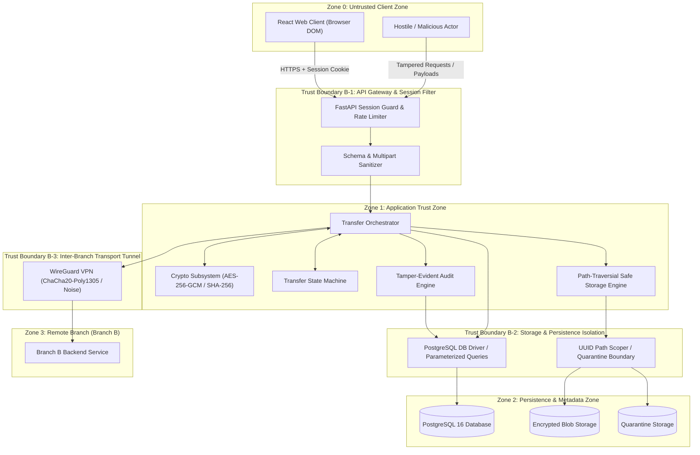

# Architecture Diagram — Trust Boundaries & Zones

**Project**: `f9l3_53nd` — Secure Authenticated File Transfer Platform  

---

## 1. Trust Boundaries Diagram

---

## 2. Trust Boundary Rules & Invariants

1. **Untrusted to Application (B-1)**: No parameter, header, or body is assumed valid. All inputs are validated via Pydantic; cookies must match an unexpired, unrevoked server session.
2. **Application to Persistence (B-2)**: No raw plaintext master key is ever stored in PostgreSQL; file storage paths are exclusively derived from server-generated UUIDs.
3. **Branch-to-Branch Network (B-3)**: Transmitted traffic is encapsulated in WireGuard; all file payloads are additionally encrypted at Layer 7 using AES-256-GCM with individual DEKs.
