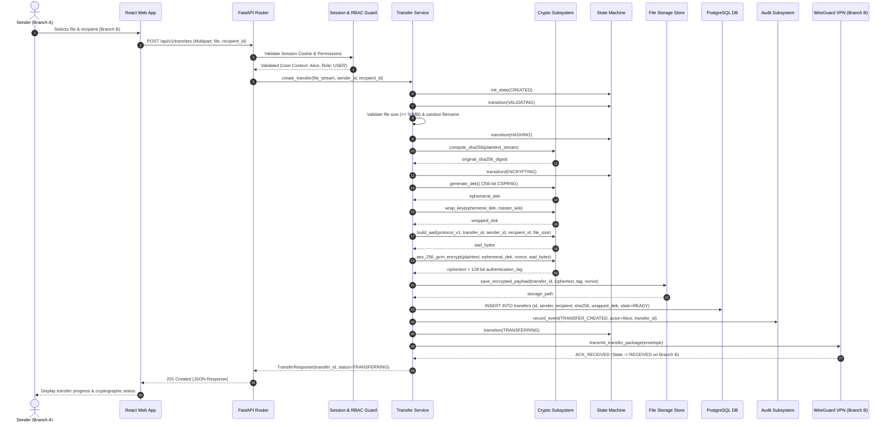

# Architecture Diagram — Transfer Upload Sequence

**Project**: `f9l3_53nd` — Secure Authenticated File Transfer Platform  

---

## 1. Upload & Transmission Sequence

---

## 2. Invariant Checklist during Upload

1. **Pre-encryption Digesting**: SHA-256 is strictly computed on the *original plaintext* before AES-GCM encryption occurs.
2. **Ephemeral DEK Generation**: A new 256-bit random DEK is generated per transfer and never reused across files.
3. **Atomic Persistence**: Transfer metadata, wrapped DEK, and initial audit log record are committed inside a transactional database boundary.
