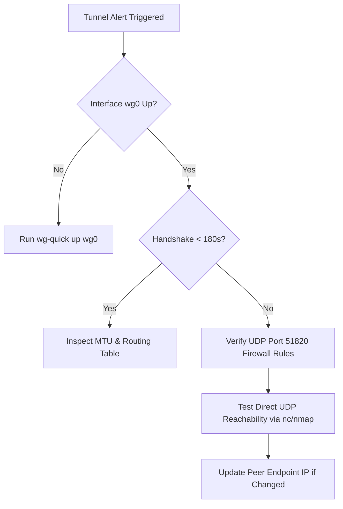

# Network Failover & Tunnel Troubleshooting Procedure

## 1. Network Architecture Overview
Branch A and Branch B communicate over a point-to-point WireGuard tunnel on overlay subnet `10.13.37.0/24`.

- **Branch A (HQ)**: `10.13.37.1` (ListenPort: 51820)
- **Branch B (Remote)**: `10.13.37.2` (ListenPort: 51821)
- **Cryptokey Routing**: Packets matching `AllowedIPs = 10.13.37.x/32` are authenticated and routed into the kernel tunnel.

---

## 2. Monitoring & Degradation Detection

### 2.1 Live Tunnel Health Telemetry
Query current tunnel status using `f9l3ctl`:
```bash
scripts/f9l3ctl.sh network-status --json
```

Output indicators:
- `latest_handshake_seconds_ago > 180`: Handshake timeout; tunnel link is down or blocked by firewall.
- `status != "ACTIVE"`: Network interface `wg0` is down or unconfigured.

---

## 3. Step-by-Step Triage Workflow



### 3.1 Step 1: Verify Kernel Interface
```bash
sudo wg show wg0
```
Ensure public key matches peer and `endpoint` is reachable.

### 3.2 Step 2: Restart Tunnel Interface
```bash
sudo wg-quick down infra/wireguard/branch-a/wg0.conf
sudo wg-quick up infra/wireguard/branch-a/wg0.conf
```

### 3.3 Step 3: Run Validation Diagnostics
```bash
bash scripts/validate-tunnel.sh
```

---

## 4. Emergency Backup Transit Failover

If the primary WAN link between Branch A and Branch B experiences an extended fiber cut:
1. Switch WireGuard peer endpoint configuration to the secondary LTE/satellite IP address in `wg0.conf`:
   ```ini
   [Peer]
   Endpoint = backup-wan.branch-b.example.com:51821
   ```
2. Apply changes non-disruptively:
   ```bash
   sudo wg set wg0 peer "<PeerPublicKey>" endpoint "backup-wan.branch-b.example.com:51821"
   ```
3. Verify resumption of handshake packets and execute smoke transfer.
