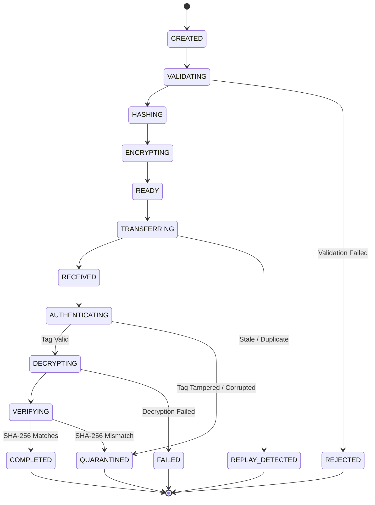

# Security Model & Architecture Principles — f9l3_53nd

**Document Version**: 1.0.0  
**Project**: `f9l3_53nd` — Secure Authenticated File Transfer Platform  
**Classification**: Cryptographic & Application Security Architecture  

---

## 1. Security Philosophy & Principles

The security architecture of `f9l3_53nd` is designed upon strict, non-negotiable security engineering principles:

```text
Security Requirement
        ↓
Threat Identification (STRIDE)
        ↓
Security Control Design
        ↓
Implementation in Code
        ↓
Adversarial Verification Test
        ↓
Evidence & Documentation
```

### Core Tenets:
1. **Defense-in-Depth**: No single layer of defense is trusted exclusively. Network encryption (WireGuard) is layered beneath application-layer authenticated encryption (AES-256-GCM), which is layered beneath cryptographic digest verification (SHA-256).
2. **Deny-by-Default & Complete Mediation**: Every request for a resource, file, or metadata must be authenticated and authorized on the server side against the actor's session and ownership permissions before processing.
3. **Fail-Closed Operation**: If any cryptographic check (AES-GCM tag verification, SHA-256 digest comparison, replay check, session validity) fails or throws an exception, the operation immediately aborts, no plaintext is released, the payload is quarantined, and an audit event is emitted.
4. **Zero Trust in Client-Side Input**: The frontend browser client is considered an untrusted presentation layer. All validations (file sizes, formats, paths, ownership, credentials) are enforced authoritatively on the server.
5. **No Security Theater & Intellectual Honesty**: Cryptographic primitives are standard (NIST/RFC approved), implemented via audited libraries (`cryptography`), and system limitations are transparently documented.

---

## 2. Trust Boundaries & Network Zones

```text
┌────────────────────────────────────────────────────────────────────────┐
│ UNTRUSTED CLIENT ZONE                                                  │
│  - React / Browser Web Client                                          │
│  - Hostile or compromised user inputs                                  │
└───────────────────────────────────┬────────────────────────────────────┘
                                    │ HTTPS (TLS) + HttpOnly Session Cookie
                                    ▼ [Boundary B-1: API Gateway & Auth Guard]
┌────────────────────────────────────────────────────────────────────────┐
│ APPLICATION TRUST ZONE (Branch A / Branch B Core)                     │
│  - FastAPI Service (Request validation, RBAC, Complete Mediation)      │
│  - Cryptographic Subsystem (AES-256-GCM, SHA-256, DEK Generation)      │
│  - Storage Subsystem (Path traversal isolation, Quarantine)            │
│  - Audit Subsystem (Tamper-evident log chaining)                       │
└──────────────────┬─────────────────────────────────┬───────────────────┘
                   │                                 │
                   │ Authenticated Queries           │ WireGuard VPN Tunnel
                   ▼ [Boundary B-2]                  ▼ [Boundary B-3]
┌───────────────────────────────┐ ┌──────────────────────────────────────┐
│ DATABASE & METADATA ZONE      │ │ TRANSPORT ZONE (Branch-to-Branch)    │
│  - PostgreSQL 16 (Relational) │ │  - Noise Protocol / ChaCha20-Poly1305│
│  - Encrypted User Hashes      │ │  - 10.50.0.1 ↔ 10.50.0.2 Point-to-Pt │
│  - Chained Audit Digest Log   │ │  - Replay & Eavesdropping Resistance │
└───────────────────────────────┘ └──────────────────────────────────────┘
```

### Trust Boundary Definitions:
- **Boundary B-1 (Client ↔ API)**: Untrusted boundary. All HTTP headers, cookies, file names, and multipart uploads are subjected to strict schema validation and sanitization.
- **Boundary B-2 (Application ↔ Database / Storage)**: Controlled boundary. Plaintext encryption keys are never stored in the database. Storage paths are strictly decoupled from user-provided file names.
- **Boundary B-3 (Branch A ↔ Branch B Network Transport)**: Untrusted network transit encapsulating traffic inside a point-to-point WireGuard VPN tunnel.

---

## 3. Cryptographic Security Model

### 3.1 Primitive Selection & Rationale

| Primitive | Standard | Role in System | Rationale & Security Property |
| :--- | :--- | :--- | :--- |
| **AES-256-GCM** | NIST SP 800-38D / RFC 5116 | Application File Payload Encryption | Authenticated Encryption with Associated Data (AEAD). Provides confidentiality and ciphertext integrity simultaneously in constant-time hardware-accelerated mode. |
| **SHA-256** | FIPS 180-4 | Original File Digest Verification & Audit Chaining | Cryptographic hash function providing 128-bit collision resistance and 256-bit preimage resistance to detect transmission and corruption errors. |
| **Argon2id** | RFC 9106 | User Password Hashing | Memory-hard password hashing algorithm resistant to both side-channel attacks and GPU/ASIC brute-force cracking. |
| **AES Key Wrap (KW)** | NIST SP 800-38F / RFC 3394 | DEK Wrapping via Master Key (KEK) | Deterministic authenticated key wrapping preventing exposure of ephemeral Data Encryption Keys at rest. |
| **CSPRNG** | OS `/dev/urandom` / `os.urandom` | Nonces, Keys, Session IDs | High-entropy cryptographically secure pseudorandom number generation. |

### 3.2 Key Hierarchy & Management

To prevent encrypting large volumes of data under a single static key (which increases risk of key exhaustion and catastrophic single-key compromise), `f9l3_53nd` implements a two-tier key hierarchy:

```text
┌────────────────────────────────────────────────────────┐
│ Master Key (KEK - Key Encryption Key)                  │
│  - 256-bit AES Key                                     │
│  - Sourced securely from environment / KMS             │
│  - NEVER stored in database, code, or Git              │
└───────────────────────────┬────────────────────────────┘
                            │ Key Wrap (RFC 3394)
                            ▼
┌────────────────────────────────────────────────────────┐
│ Per-Transfer Data Encryption Key (DEK)                 │
│  - Ephemeral 256-bit random AES key generated per file │
│  - Stored wrapped in database metadata                 │
│  - Zeroized from RAM after encryption/decryption       │
└───────────────────────────┬────────────────────────────┘
                            │ AES-256-GCM Encrypt / Decrypt
                            ▼
┌────────────────────────────────────────────────────────┐
│ File Payload Ciphertext & 128-bit Authentication Tag   │
└────────────────────────────────────────────────────────┘
```

### 3.3 Nonce Management & GCM Security
- **Nonce Size**: Standard 96 bits (12 bytes) as recommended by NIST SP 800-38D for optimal GCM security and performance.
- **Generation Method**: High-entropy cryptographically secure random bytes (`os.urandom(12)`).
- **Collision Bound**: Because a unique ephemeral DEK is generated for each transfer, a nonce is never used more than once under the same DEK. Under this per-transfer DEK model, the probability of nonce reuse is zero.

### 3.4 Authenticated Associated Data (AAD) Design
In AES-256-GCM, Authenticated Associated Data (AAD) is data that is authenticated by the GCM tag but transmitted in plaintext. The system binds the following metadata fields into the GCM authentication tag:

$$\text{AAD} = \text{protocol\_version} \parallel \text{transfer\_id} \parallel \text{sender\_id} \parallel \text{recipient\_id} \parallel \text{file\_size} \parallel \text{algorithm}$$

**Security Rationale**:
- Prevents **Ciphertext Splicing / Substitution Attacks**: An attacker cannot take a valid ciphertext from Transfer X and replay it as Transfer Y.
- Prevents **Sender/Recipient Spoofing**: The recipient cannot decrypt the file if the sender or recipient metadata in the database has been tampered with.

### 3.5 Dual-Layer Integrity Verification Flow

```text
[SENDER WORKFLOW]
Original Plaintext File
        │
        ├───────────────────────────────► Compute SHA-256 Digest (Digest_orig)
        │
        ▼
AES-256-GCM Encrypt (DEK, Nonce, AAD)
        │
        ▼
Ciphertext + 128-bit Authentication Tag + Wrapped DEK
        │
        ▼ [Transmitted across WireGuard Tunnel]
[RECEIVER WORKFLOW]
        │
        ▼
AEAD Authentication & Decryption (DEK, Nonce, AAD, Tag)
        │
        ├─► [Tag / AAD Tampered] ─────► Immediate FAIL & QUARANTINE (No Plaintext Released)
        │
        ▼ [Tag Valid]
Decrypted Plaintext File
        │
        ▼
Compute SHA-256 Digest (Digest_recv)
        │
        ├─► [Digest_recv != Digest_orig] ─► Immediate FAIL & QUARANTINE
        │
        ▼ [Digest_recv == Digest_orig]
Verified Plaintext Available for Authorized Download (COMPLETED)
```

---

## 4. Identity, Authentication & Authorization Model

### 4.1 Password Security (Argon2id)
- Passwords are never stored in plaintext or reversible encryption.
- Hashing utilizes **Argon2id** with standard OWASP-recommended parameters:
  - Memory cost: $65536 \text{ KiB}$ ($64 \text{ MiB}$)
  - Time cost (iterations): $3$
  - Parallelism: $4$ lanes
  - Salt: 16 bytes cryptographically secure random salt generated per user.

### 4.2 Session Architecture & Protection
- **Session Tokens**: 256-bit cryptographically secure random tokens generated via `secrets.token_urlsafe(32)`.
- **Cookie Security**:
  - `HttpOnly = True`: Blocks client-side JavaScript access (mitigating DOM-based XSS session theft).
  - `SameSite = Lax`: Prevents Cross-Site Request Forgery (CSRF) on cross-origin requests.
  - `Secure = True` (in production/HTTPS): Ensures session cookies are never transmitted in cleartext.
- **Server-Side Session Store**: Tracks session creation, last seen time, expiration, and active status. Supports instant revocation upon logout or administrative account suspension.

### 4.3 Role-Based Access Control (RBAC) & Object Authorization (Complete Mediation)
- Every incoming API request passes through dependency injection authentication guards before reaching route logic.
- **BOLA / IDOR Prevention**: Authorization does not stop at checking if a user is authenticated. When accessing `/transfers/{transfer_id}`, the system verifies:
  $$\text{User is SENDER} \lor \text{User is RECIPIENT} \lor \text{User is ADMIN}$$
  Unauthorized requests are rejected with `403 Forbidden` (or indistinguishable `404 Not Found` where metadata existence must be hidden).

---

## 5. Storage Security & Path Traversal Prevention

The storage engine treats all user-supplied filenames as untrusted metadata.

1. **Storage Decoupling**:
   - Original filename (e.g., `payroll_report.pdf` or malicious `../../etc/passwd`) is stored strictly as a string in the PostgreSQL database.
   - Physical storage on disk uses cryptographically unpredictable UUIDs:
     `storage/encrypted/<transfer-uuid>/payload.enc`
2. **Path Canonicalization**:
   - Path resolution explicitly enforces base directory containment via `os.path.realpath` and `Path.resolve()`, ensuring no path escapes the designated `storage/` directory tree.
3. **Quarantine Isolation**:
   - Files that fail AEAD tag verification or SHA-256 digest comparison are moved to `storage/quarantine/<transfer-uuid>/` with restricted permissions for forensic inspection by administrators.

---

## 6. Transfer State Machine & Fail-Closed Invariants

Transfers are controlled by a finite state machine with strict, valid directed transitions:



### Invariants:
- **Invariant 1**: No file payload can transition to `COMPLETED` without passing both AEAD tag authentication AND SHA-256 verification.
- **Invariant 2**: Plaintext files are never written to permanent destination storage if any intermediate verification step fails.
- **Invariant 3**: Terminal failure states (`FAILED`, `QUARANTINED`, `REJECTED`, `REPLAY_DETECTED`) cannot transition to any active state.

---

## 7. Tamper-Evident Audit Logging Model

Audit logging provides accountability and non-repudiation for all security-relevant actions.

### 7.1 Event Schema
Every audit entry contains:
```json
{
  "id": "uuid-v4",
  "timestamp": "2026-08-29T17:30:00.000Z",
  "event_type": "INTEGRITY_MISMATCH",
  "severity": "CRITICAL",
  "actor_id": "user-uuid",
  "request_id": "req-uuid",
  "transfer_id": "transfer-uuid",
  "source_ip": "10.50.0.1",
  "metadata": { "expected_sha256": "...", "received_sha256": "..." },
  "previous_digest": "sha256-hex-of-prior-event",
  "event_digest": "sha256-hex-of-this-event"
}
```

### 7.2 Cryptographic Digest Chaining
To detect retroactive tampering or deletion of log entries:
$$\text{event\_digest}_n = \text{SHA-256}(\text{event\_digest}_{n-1} \parallel \text{id}_n \parallel \text{timestamp}_n \parallel \text{event\_type}_n \parallel \text{actor\_id}_n \parallel \text{metadata}_n)$$

**Security Property**: Any modification, insertion, or deletion of historical audit records invalidates the digest chain starting from the modified event forward.

---

## 8. Network Transport Model (WireGuard)

WireGuard operates at the network layer (OSI Layer 3/4) creating a cryptographically secure UDP-based tunnel between Branch A (`10.50.0.1`) and Branch B (`10.50.0.2`).

### Synergy with Application Layer AEAD:
- **WireGuard**: Provides transport confidentiality, network traffic padding, IP routing isolation, and resistance to network-level Man-in-the-Middle (MitM) attackers.
- **AES-256-GCM Application Layer**: Provides end-to-end payload confidentiality at rest in storage, recipient-bound cryptographic access control, and defense against insider network surveillance.

---

## 9. Residual Risk & Architectural Limitations

In accordance with our intellectual honesty guidelines, the security guarantees of this system have the following defined boundaries:

1. **Compromised Endpoint Boundary**: If an attacker gains administrative/root control or memory access on the server running the backend, they can read the master key in RAM or intercept decrypted payloads during processing.
2. **Database Superuser Tampering**: An attacker with root database access can alter rows and re-calculate the entire audit hash chain from the root. To mitigate this in enterprise production, audit logs should be replicated to an immutable write-once-read-many (WORM) external SIEM.
3. **Bandwidth Denial of Service**: While application rate-limiting protects API resources, volumetric network exhaustion on the external interface before reaching the WireGuard port cannot be prevented at the software layer alone.
